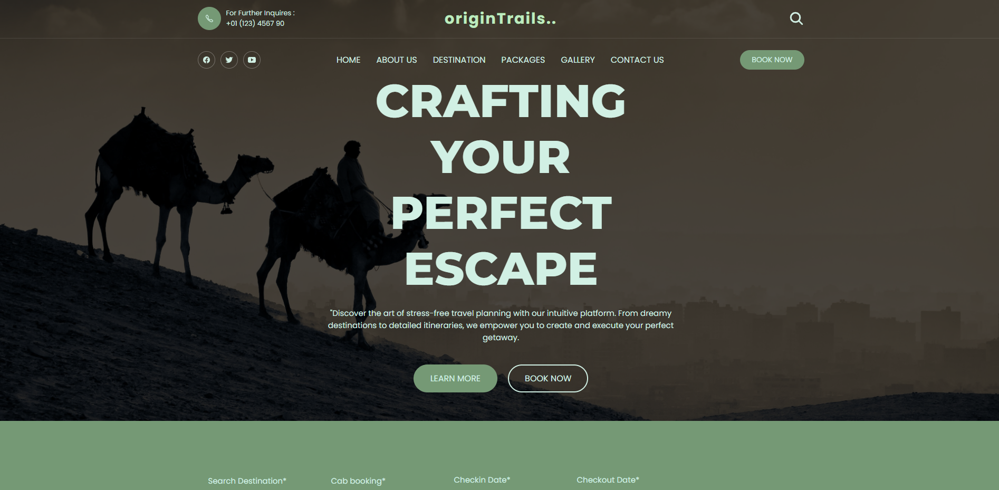
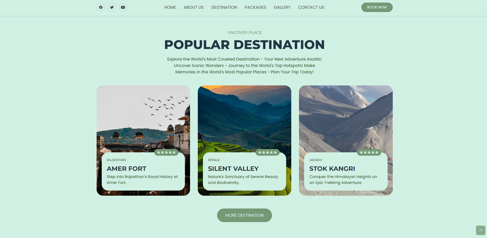
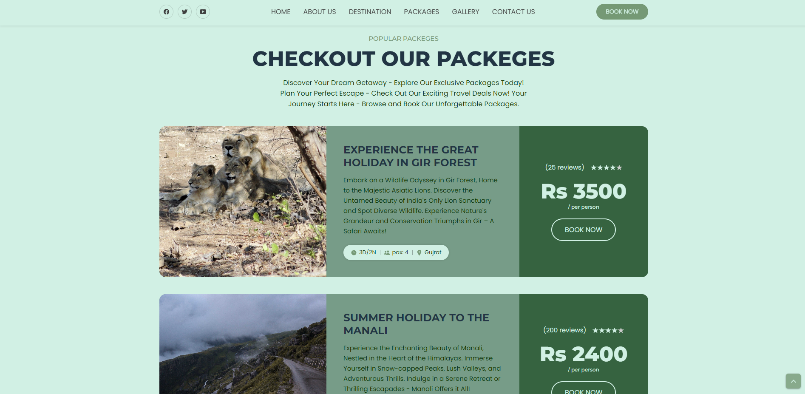
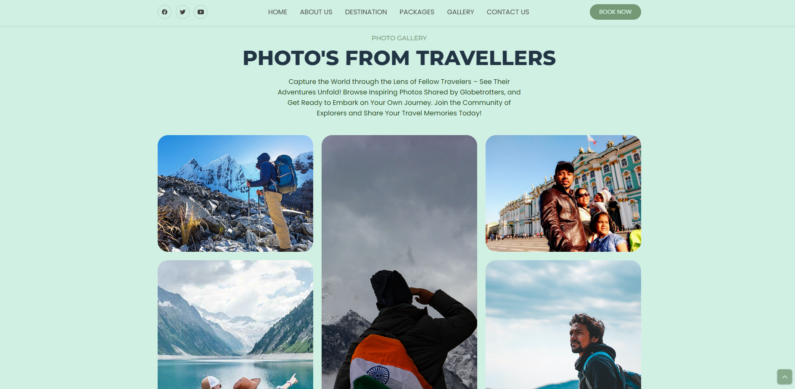
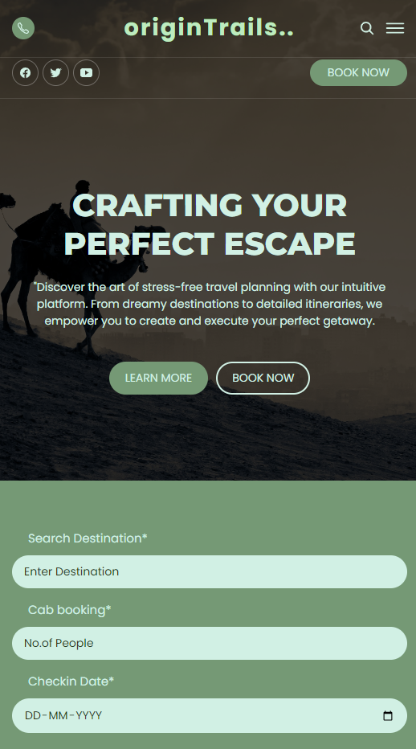

<div align="center">

  <br />
  

  <h2 align="center">originTrails</h2>

  originTrails is fully responsive travel website, <br />Responsive for all devices, built using HTML, CSS, and JavaScript.

  <a href="https://ashutosh-kumar-21-bcs-5832.vercel.app/#"><strong>➥ Live Demo</strong></a>

</div>

<br />

### Demo Screeshots



# Discover popular destinations


# Packagages


# Photos from travellers


# Mobile view [Responsive-Ness]


### Prerequisites

Before you begin, ensure you have met the following requirements:

* [Git](https://git-scm.com/downloads "Download Git") must be installed on your operating system.

### Run Locally

To run **OriginTrails** locally, run this command on your git bash:

Linux and macOS:

```bash
sudo git https://github.com/ashutosh0814/AshutoshKumar_21BCS5832.git
```

Windows:

```bash
git clone https://github.com/ashutosh0814/AshutoshKumar_21BCS5832.git
```

Just run the **index.html** file on live server to view 

### Contact

If you want to contact with me you can reach me at [LinkedIn](https://www.linkedin.com/in/ashutosh-srivastava-573227206).


